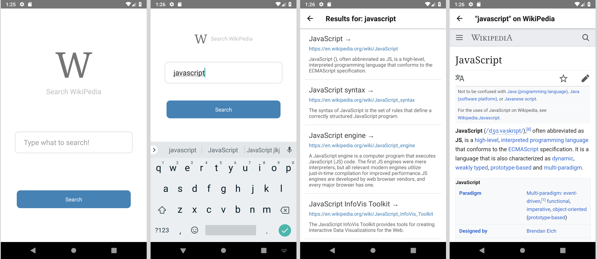

# WikiSearch - React Native

This is a basic react native app where user can search on wikipedia and can view the article inside the web view.

This projects explores the basics of react native: Using core react native components, styling, navigation & data fetching.

